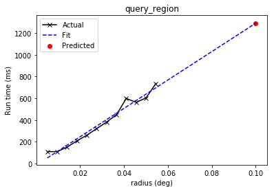
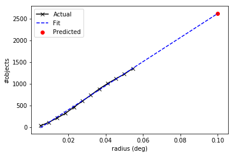

.. raw:: html

    <a href="../_static/conesearch/conesearch.ipynb"><button id="download">Download tutorial notebook</button></a>
    <a href="https://beta.mybinder.org/v2/gh/astropy/astropy-tutorials/master?filepath=/tutorials/notebooks/conesearch/conesearch.ipynb"><button id="binder">Interactive tutorial notebook</button></a>

    

.. role:: inputnumrole
.. role:: outputnumrole

.. _conesearch:

VO Simple Cone Search Tutorial
==============================

This tutorial requires ``astroquery`` 0.3.5 or greater. Cone Search
allows you to query a catalog of astronomical sources and obtain those
that lie within a cone of a given radius around the given position. For
more information on Cone Search, see
http://astroquery.readthedocs.io/en/latest/vo\_conesearch/vo\_conesearch.html.

:inputnumrole:`In[1]:`

.. code:: python

    # Python standard library
    import time
    import warnings
    
    # Third-party software
    import numpy as np
    
    # Astropy
    from astropy import coordinates as coord
    from astropy import units as u
    from astropy.table import Table
    
    # Astroquery
    import astroquery
    from astroquery.simbad import Simbad
    from astroquery.vo_conesearch import conf, conesearch, vos_catalog
    
    # Set up matplotlib
    import matplotlib.pyplot as plt
    %matplotlib inline

It might be useful to list the available Cone Search catalogs first. By
default, catalogs that pass nightly validation are included. Validation
is hosted by Space Telescope Science Institute (STScI).

:inputnumrole:`In[2]:`

.. code:: python

    conesearch.list_catalogs()

:outputnumrole:`Out[2]:`

.. parsed-literal::

    Downloading http://stsdas.stsci.edu/astrolib/vo_databases/conesearch_good.json [Done]

.. parsed-literal::

    ['SDSS DR7 - Sloan Digital Sky Survey Data Release 7 1',
     'SDSS DR7 - Sloan Digital Sky Survey Data Release 7 2',
     'SDSS DR7 - Sloan Digital Sky Survey Data Release 7 3',
     'SDSS DR7 - Sloan Digital Sky Survey Data Release 7 4',
     'SDSS DR8 - Sloan Digital Sky Survey Data Release 8 2',
     'The HST Guide Star Catalog, Version 1.1 (Lasker+ 1992) 1',
     'The HST Guide Star Catalog, Version 1.2 (Lasker+ 1996) 1',
     'The HST Guide Star Catalog, Version GSC-ACT (Lasker+ 1996-99) 1',
     'The USNO-A2.0 Catalogue (Monet+ 1998) 1',
     'Two Micron All Sky Survey (2MASS) 1',
     'Two Micron All Sky Survey (2MASS) 2',
     'USNO-A2 Catalogue 1']

Next, let's pick an astronomical object of interest. For example, M31.

:inputnumrole:`In[3]:`

.. code:: python

    c = coord.SkyCoord.from_name('M31', frame='icrs')
    print(c)

:outputnumrole:`Out[3]:`

.. parsed-literal::

    <SkyCoord (ICRS): (ra, dec) in deg
        (10.6847083, 41.26875)>

By default, a basic Cone Search goes through the list of catalogs and
*stops* at the first one that returns non-empty VO table. Let's search
for objects within 0.1 degree around M31. You will see a lot of warnings
that were generated by VO table parser but ignored by Cone Search
service validator. VO compliance enforced by Cone Search providers is
beyond the control of ``astroquery.vo_conesearch`` package.

:inputnumrole:`In[4]:`

.. code:: python

    result = conesearch.conesearch(c, 0.1 * u.degree)

:outputnumrole:`Out[4]:`

.. parsed-literal::

    Trying http://wfaudata.roe.ac.uk/sdssdr7-dsa/DirectCone?DSACAT=SDSS_DR7&DSATAB=Galaxy&

.. parsed-literal::

    WARNING: W50: http://wfaudata.roe.ac.uk/sdssdr7-dsa/DirectCone?DSACAT=SDSS_DR7&DSATAB=Galaxy&RA=10.6847083&DEC=41.26875&SR=0.1&VERB=1:66:0: W50: Invalid unit string 'deg/day' [astropy.io.votable.tree]
    WARNING: W50: http://wfaudata.roe.ac.uk/sdssdr7-dsa/DirectCone?DSACAT=SDSS_DR7&DSATAB=Galaxy&RA=10.6847083&DEC=41.26875&SR=0.1&VERB=1:69:0: W50: Invalid unit string 'deg/day' [astropy.io.votable.tree]
    WARNING: W50: http://wfaudata.roe.ac.uk/sdssdr7-dsa/DirectCone?DSACAT=SDSS_DR7&DSATAB=Galaxy&RA=10.6847083&DEC=41.26875&SR=0.1&VERB=1:72:0: W50: Invalid unit string 'deg/day' [astropy.io.votable.tree]
    WARNING: W50: http://wfaudata.roe.ac.uk/sdssdr7-dsa/DirectCone?DSACAT=SDSS_DR7&DSATAB=Galaxy&RA=10.6847083&DEC=41.26875&SR=0.1&VERB=1:75:0: W50: Invalid unit string 'deg/day' [astropy.io.votable.tree]
    WARNING: W50: http://wfaudata.roe.ac.uk/sdssdr7-dsa/DirectCone?DSACAT=SDSS_DR7&DSATAB=Galaxy&RA=10.6847083&DEC=41.26875&SR=0.1&VERB=1:138:0: W50: Invalid unit string 'maggies/arcsec^2' [astropy.io.votable.tree]
    WARNING: W50: http://wfaudata.roe.ac.uk/sdssdr7-dsa/DirectCone?DSACAT=SDSS_DR7&DSATAB=Galaxy&RA=10.6847083&DEC=41.26875&SR=0.1&VERB=1:141:0: W50: Invalid unit string 'maggies/arcsec^2' [astropy.io.votable.tree]
    WARNING: W50: http://wfaudata.roe.ac.uk/sdssdr7-dsa/DirectCone?DSACAT=SDSS_DR7&DSATAB=Galaxy&RA=10.6847083&DEC=41.26875&SR=0.1&VERB=1:144:0: W50: Invalid unit string 'maggies/arcsec^2' [astropy.io.votable.tree]
    WARNING: W50: http://wfaudata.roe.ac.uk/sdssdr7-dsa/DirectCone?DSACAT=SDSS_DR7&DSATAB=Galaxy&RA=10.6847083&DEC=41.26875&SR=0.1&VERB=1:147:0: W50: Invalid unit string 'maggies/arcsec^2' [astropy.io.votable.tree]
    WARNING: W50: http://wfaudata.roe.ac.uk/sdssdr7-dsa/DirectCone?DSACAT=SDSS_DR7&DSATAB=Galaxy&RA=10.6847083&DEC=41.26875&SR=0.1&VERB=1:150:0: W50: Invalid unit string 'maggies/arcsec^2' [astropy.io.votable.tree]
    WARNING: W50: http://wfaudata.roe.ac.uk/sdssdr7-dsa/DirectCone?DSACAT=SDSS_DR7&DSATAB=Galaxy&RA=10.6847083&DEC=41.26875&SR=0.1&VERB=1:153:0: W50: Invalid unit string 'maggies/arcsec^2' (suppressing further warnings of this type...) [astropy.io.votable.tree]

.. parsed-literal::

    Trying http://wfaudata.roe.ac.uk/sdssdr7-dsa/DirectCone?DSACAT=SDSS_DR7&DSATAB=Star&

.. parsed-literal::

    WARNING: W25: ?:?:?: W25: 'http://wfaudata.roe.ac.uk/sdssdr7-dsa/DirectCone?DSACAT=SDSS_DR7&DSATAB=Galaxy&' failed with: Catalog server 'http://wfaudata.roe.ac.uk/sdssdr7-dsa/DirectCone?DSACAT=SDSS_DR7&DSATAB=Galaxy&' returned 0 result [astroquery.vo_conesearch.conesearch]
    WARNING: W50: http://wfaudata.roe.ac.uk/sdssdr7-dsa/DirectCone?DSACAT=SDSS_DR7&DSATAB=Star&RA=10.6847083&DEC=41.26875&SR=0.1&VERB=1:66:0: W50: Invalid unit string 'deg/day' [astropy.io.votable.tree]
    WARNING: W50: http://wfaudata.roe.ac.uk/sdssdr7-dsa/DirectCone?DSACAT=SDSS_DR7&DSATAB=Star&RA=10.6847083&DEC=41.26875&SR=0.1&VERB=1:69:0: W50: Invalid unit string 'deg/day' [astropy.io.votable.tree]
    WARNING: W50: http://wfaudata.roe.ac.uk/sdssdr7-dsa/DirectCone?DSACAT=SDSS_DR7&DSATAB=Star&RA=10.6847083&DEC=41.26875&SR=0.1&VERB=1:72:0: W50: Invalid unit string 'deg/day' [astropy.io.votable.tree]
    WARNING: W50: http://wfaudata.roe.ac.uk/sdssdr7-dsa/DirectCone?DSACAT=SDSS_DR7&DSATAB=Star&RA=10.6847083&DEC=41.26875&SR=0.1&VERB=1:75:0: W50: Invalid unit string 'deg/day' [astropy.io.votable.tree]
    WARNING: W50: http://wfaudata.roe.ac.uk/sdssdr7-dsa/DirectCone?DSACAT=SDSS_DR7&DSATAB=Star&RA=10.6847083&DEC=41.26875&SR=0.1&VERB=1:138:0: W50: Invalid unit string 'maggies/arcsec^2' [astropy.io.votable.tree]
    WARNING: W50: http://wfaudata.roe.ac.uk/sdssdr7-dsa/DirectCone?DSACAT=SDSS_DR7&DSATAB=Star&RA=10.6847083&DEC=41.26875&SR=0.1&VERB=1:141:0: W50: Invalid unit string 'maggies/arcsec^2' [astropy.io.votable.tree]
    WARNING: W50: http://wfaudata.roe.ac.uk/sdssdr7-dsa/DirectCone?DSACAT=SDSS_DR7&DSATAB=Star&RA=10.6847083&DEC=41.26875&SR=0.1&VERB=1:144:0: W50: Invalid unit string 'maggies/arcsec^2' [astropy.io.votable.tree]
    WARNING: W50: http://wfaudata.roe.ac.uk/sdssdr7-dsa/DirectCone?DSACAT=SDSS_DR7&DSATAB=Star&RA=10.6847083&DEC=41.26875&SR=0.1&VERB=1:147:0: W50: Invalid unit string 'maggies/arcsec^2' [astropy.io.votable.tree]
    WARNING: W50: http://wfaudata.roe.ac.uk/sdssdr7-dsa/DirectCone?DSACAT=SDSS_DR7&DSATAB=Star&RA=10.6847083&DEC=41.26875&SR=0.1&VERB=1:150:0: W50: Invalid unit string 'maggies/arcsec^2' [astropy.io.votable.tree]
    WARNING: W50: http://wfaudata.roe.ac.uk/sdssdr7-dsa/DirectCone?DSACAT=SDSS_DR7&DSATAB=Star&RA=10.6847083&DEC=41.26875&SR=0.1&VERB=1:153:0: W50: Invalid unit string 'maggies/arcsec^2' (suppressing further warnings of this type...) [astropy.io.votable.tree]
    WARNING: W25: ?:?:?: W25: 'http://wfaudata.roe.ac.uk/sdssdr7-dsa/DirectCone?DSACAT=SDSS_DR7&DSATAB=Star&' failed with: Catalog server 'http://wfaudata.roe.ac.uk/sdssdr7-dsa/DirectCone?DSACAT=SDSS_DR7&DSATAB=Star&' returned 0 result [astroquery.vo_conesearch.conesearch]

.. parsed-literal::

    Trying http://wfaudata.roe.ac.uk/sdssdr7-dsa/DirectCone?DSACAT=SDSS_DR7&DSATAB=PhotoObjAll&

.. parsed-literal::

    WARNING: W50: http://wfaudata.roe.ac.uk/sdssdr7-dsa/DirectCone?DSACAT=SDSS_DR7&DSATAB=PhotoObjAll&RA=10.6847083&DEC=41.26875&SR=0.1&VERB=1:66:0: W50: Invalid unit string 'deg/day' [astropy.io.votable.tree]
    WARNING: W50: http://wfaudata.roe.ac.uk/sdssdr7-dsa/DirectCone?DSACAT=SDSS_DR7&DSATAB=PhotoObjAll&RA=10.6847083&DEC=41.26875&SR=0.1&VERB=1:69:0: W50: Invalid unit string 'deg/day' [astropy.io.votable.tree]
    WARNING: W50: http://wfaudata.roe.ac.uk/sdssdr7-dsa/DirectCone?DSACAT=SDSS_DR7&DSATAB=PhotoObjAll&RA=10.6847083&DEC=41.26875&SR=0.1&VERB=1:72:0: W50: Invalid unit string 'deg/day' [astropy.io.votable.tree]
    WARNING: W50: http://wfaudata.roe.ac.uk/sdssdr7-dsa/DirectCone?DSACAT=SDSS_DR7&DSATAB=PhotoObjAll&RA=10.6847083&DEC=41.26875&SR=0.1&VERB=1:75:0: W50: Invalid unit string 'deg/day' [astropy.io.votable.tree]
    WARNING: W50: http://wfaudata.roe.ac.uk/sdssdr7-dsa/DirectCone?DSACAT=SDSS_DR7&DSATAB=PhotoObjAll&RA=10.6847083&DEC=41.26875&SR=0.1&VERB=1:138:0: W50: Invalid unit string 'maggies/arcsec^2' [astropy.io.votable.tree]
    WARNING: W50: http://wfaudata.roe.ac.uk/sdssdr7-dsa/DirectCone?DSACAT=SDSS_DR7&DSATAB=PhotoObjAll&RA=10.6847083&DEC=41.26875&SR=0.1&VERB=1:141:0: W50: Invalid unit string 'maggies/arcsec^2' [astropy.io.votable.tree]
    WARNING: W50: http://wfaudata.roe.ac.uk/sdssdr7-dsa/DirectCone?DSACAT=SDSS_DR7&DSATAB=PhotoObjAll&RA=10.6847083&DEC=41.26875&SR=0.1&VERB=1:144:0: W50: Invalid unit string 'maggies/arcsec^2' [astropy.io.votable.tree]
    WARNING: W50: http://wfaudata.roe.ac.uk/sdssdr7-dsa/DirectCone?DSACAT=SDSS_DR7&DSATAB=PhotoObjAll&RA=10.6847083&DEC=41.26875&SR=0.1&VERB=1:147:0: W50: Invalid unit string 'maggies/arcsec^2' [astropy.io.votable.tree]
    WARNING: W50: http://wfaudata.roe.ac.uk/sdssdr7-dsa/DirectCone?DSACAT=SDSS_DR7&DSATAB=PhotoObjAll&RA=10.6847083&DEC=41.26875&SR=0.1&VERB=1:150:0: W50: Invalid unit string 'maggies/arcsec^2' [astropy.io.votable.tree]
    WARNING: W50: http://wfaudata.roe.ac.uk/sdssdr7-dsa/DirectCone?DSACAT=SDSS_DR7&DSATAB=PhotoObjAll&RA=10.6847083&DEC=41.26875&SR=0.1&VERB=1:153:0: W50: Invalid unit string 'maggies/arcsec^2' (suppressing further warnings of this type...) [astropy.io.votable.tree]

.. parsed-literal::

    Trying http://wfaudata.roe.ac.uk/sdssdr7-dsa/DirectCone?DSACAT=SDSS_DR7&DSATAB=PhotoObj&

.. parsed-literal::

    WARNING: W25: ?:?:?: W25: 'http://wfaudata.roe.ac.uk/sdssdr7-dsa/DirectCone?DSACAT=SDSS_DR7&DSATAB=PhotoObjAll&' failed with: Catalog server 'http://wfaudata.roe.ac.uk/sdssdr7-dsa/DirectCone?DSACAT=SDSS_DR7&DSATAB=PhotoObjAll&' returned 0 result [astroquery.vo_conesearch.conesearch]
    WARNING: W50: http://wfaudata.roe.ac.uk/sdssdr7-dsa/DirectCone?DSACAT=SDSS_DR7&DSATAB=PhotoObj&RA=10.6847083&DEC=41.26875&SR=0.1&VERB=1:66:0: W50: Invalid unit string 'deg/day' [astropy.io.votable.tree]
    WARNING: W50: http://wfaudata.roe.ac.uk/sdssdr7-dsa/DirectCone?DSACAT=SDSS_DR7&DSATAB=PhotoObj&RA=10.6847083&DEC=41.26875&SR=0.1&VERB=1:69:0: W50: Invalid unit string 'deg/day' [astropy.io.votable.tree]
    WARNING: W50: http://wfaudata.roe.ac.uk/sdssdr7-dsa/DirectCone?DSACAT=SDSS_DR7&DSATAB=PhotoObj&RA=10.6847083&DEC=41.26875&SR=0.1&VERB=1:72:0: W50: Invalid unit string 'deg/day' [astropy.io.votable.tree]
    WARNING: W50: http://wfaudata.roe.ac.uk/sdssdr7-dsa/DirectCone?DSACAT=SDSS_DR7&DSATAB=PhotoObj&RA=10.6847083&DEC=41.26875&SR=0.1&VERB=1:75:0: W50: Invalid unit string 'deg/day' [astropy.io.votable.tree]
    WARNING: W50: http://wfaudata.roe.ac.uk/sdssdr7-dsa/DirectCone?DSACAT=SDSS_DR7&DSATAB=PhotoObj&RA=10.6847083&DEC=41.26875&SR=0.1&VERB=1:138:0: W50: Invalid unit string 'maggies/arcsec^2' [astropy.io.votable.tree]
    WARNING: W50: http://wfaudata.roe.ac.uk/sdssdr7-dsa/DirectCone?DSACAT=SDSS_DR7&DSATAB=PhotoObj&RA=10.6847083&DEC=41.26875&SR=0.1&VERB=1:141:0: W50: Invalid unit string 'maggies/arcsec^2' [astropy.io.votable.tree]
    WARNING: W50: http://wfaudata.roe.ac.uk/sdssdr7-dsa/DirectCone?DSACAT=SDSS_DR7&DSATAB=PhotoObj&RA=10.6847083&DEC=41.26875&SR=0.1&VERB=1:144:0: W50: Invalid unit string 'maggies/arcsec^2' [astropy.io.votable.tree]
    WARNING: W50: http://wfaudata.roe.ac.uk/sdssdr7-dsa/DirectCone?DSACAT=SDSS_DR7&DSATAB=PhotoObj&RA=10.6847083&DEC=41.26875&SR=0.1&VERB=1:147:0: W50: Invalid unit string 'maggies/arcsec^2' [astropy.io.votable.tree]
    WARNING: W50: http://wfaudata.roe.ac.uk/sdssdr7-dsa/DirectCone?DSACAT=SDSS_DR7&DSATAB=PhotoObj&RA=10.6847083&DEC=41.26875&SR=0.1&VERB=1:150:0: W50: Invalid unit string 'maggies/arcsec^2' [astropy.io.votable.tree]
    WARNING: W50: http://wfaudata.roe.ac.uk/sdssdr7-dsa/DirectCone?DSACAT=SDSS_DR7&DSATAB=PhotoObj&RA=10.6847083&DEC=41.26875&SR=0.1&VERB=1:153:0: W50: Invalid unit string 'maggies/arcsec^2' (suppressing further warnings of this type...) [astropy.io.votable.tree]

.. parsed-literal::

    Trying http://wfaudata.roe.ac.uk/sdssdr8-dsa/DirectCone?DSACAT=SDSS_DR8&DSATAB=SpecObjAll&

.. parsed-literal::

    WARNING: W25: ?:?:?: W25: 'http://wfaudata.roe.ac.uk/sdssdr7-dsa/DirectCone?DSACAT=SDSS_DR7&DSATAB=PhotoObj&' failed with: Catalog server 'http://wfaudata.roe.ac.uk/sdssdr7-dsa/DirectCone?DSACAT=SDSS_DR7&DSATAB=PhotoObj&' returned 0 result [astroquery.vo_conesearch.conesearch]
    WARNING: W50: http://wfaudata.roe.ac.uk/sdssdr8-dsa/DirectCone?DSACAT=SDSS_DR8&DSATAB=SpecObjAll&RA=10.6847083&DEC=41.26875&SR=0.1&VERB=1:51:0: W50: Invalid unit string 'days' [astropy.io.votable.tree]
    WARNING: W50: http://wfaudata.roe.ac.uk/sdssdr8-dsa/DirectCone?DSACAT=SDSS_DR8&DSATAB=SpecObjAll&RA=10.6847083&DEC=41.26875&SR=0.1&VERB=1:237:0: W50: Invalid unit string 'Angstroms' [astropy.io.votable.tree]
    WARNING: W50: http://wfaudata.roe.ac.uk/sdssdr8-dsa/DirectCone?DSACAT=SDSS_DR8&DSATAB=SpecObjAll&RA=10.6847083&DEC=41.26875&SR=0.1&VERB=1:240:0: W50: Invalid unit string 'Angstroms' [astropy.io.votable.tree]
    WARNING: W50: http://wfaudata.roe.ac.uk/sdssdr8-dsa/DirectCone?DSACAT=SDSS_DR8&DSATAB=SpecObjAll&RA=10.6847083&DEC=41.26875&SR=0.1&VERB=1:345:0: W50: Invalid unit string 'nanomaggies' [astropy.io.votable.tree]
    WARNING: W50: http://wfaudata.roe.ac.uk/sdssdr8-dsa/DirectCone?DSACAT=SDSS_DR8&DSATAB=SpecObjAll&RA=10.6847083&DEC=41.26875&SR=0.1&VERB=1:348:0: W50: Invalid unit string 'nanomaggies' [astropy.io.votable.tree]
    WARNING: W50: http://wfaudata.roe.ac.uk/sdssdr8-dsa/DirectCone?DSACAT=SDSS_DR8&DSATAB=SpecObjAll&RA=10.6847083&DEC=41.26875&SR=0.1&VERB=1:351:0: W50: Invalid unit string 'nanomaggies' [astropy.io.votable.tree]
    WARNING: W50: http://wfaudata.roe.ac.uk/sdssdr8-dsa/DirectCone?DSACAT=SDSS_DR8&DSATAB=SpecObjAll&RA=10.6847083&DEC=41.26875&SR=0.1&VERB=1:354:0: W50: Invalid unit string 'nanomaggies' [astropy.io.votable.tree]
    WARNING: W50: http://wfaudata.roe.ac.uk/sdssdr8-dsa/DirectCone?DSACAT=SDSS_DR8&DSATAB=SpecObjAll&RA=10.6847083&DEC=41.26875&SR=0.1&VERB=1:357:0: W50: Invalid unit string 'nanomaggies' [astropy.io.votable.tree]
    WARNING: W50: http://wfaudata.roe.ac.uk/sdssdr8-dsa/DirectCone?DSACAT=SDSS_DR8&DSATAB=SpecObjAll&RA=10.6847083&DEC=41.26875&SR=0.1&VERB=1:360:0: W50: Invalid unit string 'nanomaggies' [astropy.io.votable.tree]
    WARNING: W50: http://wfaudata.roe.ac.uk/sdssdr8-dsa/DirectCone?DSACAT=SDSS_DR8&DSATAB=SpecObjAll&RA=10.6847083&DEC=41.26875&SR=0.1&VERB=1:363:0: W50: Invalid unit string 'nanomaggies' (suppressing further warnings of this type...) [astropy.io.votable.tree]
    WARNING: W06: http://wfaudata.roe.ac.uk/sdssdr8-dsa/DirectCone?DSACAT=SDSS_DR8&DSATAB=SpecObjAll&RA=10.6847083&DEC=41.26875&SR=0.1&VERB=1:462:0: W06: Invalid UCD 'IMAGE?': UCD has invalid character '?' in 'IMAGE?' [astropy.io.votable.tree]
    WARNING: W25: ?:?:?: W25: 'http://wfaudata.roe.ac.uk/sdssdr8-dsa/DirectCone?DSACAT=SDSS_DR8&DSATAB=SpecObjAll&' failed with: Catalog server 'http://wfaudata.roe.ac.uk/sdssdr8-dsa/DirectCone?DSACAT=SDSS_DR8&DSATAB=SpecObjAll&' returned 0 result [astroquery.vo_conesearch.conesearch]

.. parsed-literal::

    Trying http://vizier.u-strasbg.fr/viz-bin/conesearch/I/220/out?

.. parsed-literal::

    WARNING: W22: http://vizier.u-strasbg.fr/viz-bin/conesearch/I/220/out?RA=10.6847083&DEC=41.26875&SR=0.1&VERB=1:15:0: W22: The DEFINITIONS element is deprecated in VOTable 1.1.  Ignoring [astropy.io.votable.tree]

:inputnumrole:`In[5]:`

.. code:: python

    print('First non-empty table returned by', result.url)
    print('Number of rows is', result.nrows)

:outputnumrole:`Out[5]:`

.. parsed-literal::

    First non-empty table returned by http://vizier.u-strasbg.fr/viz-bin/conesearch/I/220/out?
    Number of rows is 5

This VO table can be converted into `Astropy
table <http://astropy.readthedocs.io/en/stable/table/index.html>`__ and
then manipulated as such; e.g., re-write the table into LaTeX format.

:inputnumrole:`In[6]:`

.. code:: python

    result_tab = Table.read(result, format='votable')
    print(result_tab)

:outputnumrole:`Out[6]:`

.. parsed-literal::

       _r       GSC      RAJ2000   DEJ2000  PosErr ... Plate  Epoch   Mult Versions
      deg                  deg       deg     arcs  ...          yr                 
    -------- ---------- --------- --------- ------ ... ----- -------- ---- --------
    0.096170 0280102081  10.80558  41.23727    0.2 ...  0738 1985.877    F  GSC-all
    0.063449 0280102008  10.71207  41.20873    0.2 ...  0738 1985.877    F  GSC-all
    0.043453 0280102015  10.68782  41.22536    0.2 ...  0738 1985.877    F  GSC-all
    0.066633 0280102017  10.60025  41.24853    0.2 ...  0738 1985.877    F  GSC-all
    0.082097 0280502180  10.64539  41.34535    0.2 ...  0738 1985.877    F  GSC-all

:inputnumrole:`In[7]:`

.. code:: python

    result_tab.write('my_result.tex', format='ascii.latex')

:inputnumrole:`In[8]:`

.. code:: python

    # Now use your favorite text editor to open the my_result.tex file.
    # For example:
    !cat my_result.tex

:outputnumrole:`Out[8]:`

.. parsed-literal::

    \begin{table}
    \begin{tabular}{ccccccccccccc}
    _r & GSC & RAJ2000 & DEJ2000 & PosErr & Pmag & e_Pmag & n_Pmag & Class & Plate & Epoch & Mult & Versions \\
    $\mathrm{deg}$ &  & $\mathrm{deg}$ & $\mathrm{deg}$ & $\mathrm{arcs}$ & $\mathrm{mag}$ & $\mathrm{mag}$ &  &  &  & $\mathrm{yr}$ &  &  \\
    0.096170 & 0280102081 & 10.80558 & 41.23727 & 0.2 & 13.44 & 0.46 & 1 & 0 & 0738 & 1985.877 & F & GSC-all \\
    0.063449 & 0280102008 & 10.71207 & 41.20873 & 0.2 & 11.82 & 0.43 & 1 & 0 & 0738 & 1985.877 & F & GSC-all \\
    0.043453 & 0280102015 & 10.68782 & 41.22536 & 0.2 & 13.10 & 0.44 & 1 & 3 & 0738 & 1985.877 & F & GSC-all \\
    0.066633 & 0280102017 & 10.60025 & 41.24853 & 0.2 & 13.47 & 0.46 & 1 & 3 & 0738 & 1985.877 & F & GSC-all \\
    0.082097 & 0280502180 & 10.64539 & 41.34535 & 0.2 & 12.68 & 0.44 & 1 & 0 & 0738 & 1985.877 & F & GSC-all \\
    \end{tabular}
    \end{table}

Cone Search results can also be used in conjuction with other types of
queries. For example, you can query SIMBAD for the first entry in your
result above.

:inputnumrole:`In[9]:`

.. code:: python

    # Due to the unpredictability of external services,
    # The first successful query result (above) might differ
    # from run to run.
    #
    # CHANGE THESE VALUES to the appropriate RA and DEC
    # column names you see above, if necessary.
    ra_colname = 'RAJ2000'
    dec_colname = 'DEJ2000'

:inputnumrole:`In[10]:`

.. code:: python

    # Don't run this cell if column names above are invalid.
    if ra_colname in result_tab.colnames and dec_colname in result_tab.colnames:
        row = result_tab[0]
        simbad_obj = coord.SkyCoord(ra=row[ra_colname]*u.deg, dec=row[dec_colname]*u.deg)
        print('Searching SIMBAD for\n{}\n'.format(simbad_obj))
        simbad_result = Simbad.query_region(simbad_obj, radius=5*u.arcsec)
        print(simbad_result)
    else:
        print('{} or {} not in search results. Choose from: {}'.format(
            ra_colname, dec_colname, ' '.join(result_tab.colnames)))

:outputnumrole:`Out[10]:`

.. parsed-literal::

    Searching SIMBAD for
    <SkyCoord (ICRS): (ra, dec) in deg
        (10.80558, 41.23727)>
    
            MAIN_ID              RA      ... COO_WAVELENGTH     COO_BIBCODE    
                              "h:m:s"    ...                                   
    ----------------------- ------------ ... -------------- -------------------
    2MASS J00431336+4114139 00 43 13.369 ...              N 2003yCat.2246....0C
              [WSB85] S4  1  00 43 13.33 ...              O 1985ApJ...290..140W

Now back to Cone Search... You can extract metadata of this Cone Search
catalog.

:inputnumrole:`In[11]:`

.. code:: python

    my_db = vos_catalog.get_remote_catalog_db(conf.conesearch_dbname)
    my_cat = my_db.get_catalog_by_url(result.url)
    print(my_cat.dumps())

:outputnumrole:`Out[11]:`

.. parsed-literal::

    {
        "cap_description": "Cone search capability for table I/220/out (The Full Catalogue (25258765 positions))",
        "cap_index": 4,
        "cap_type": "conesearch",
        "content_level": "research",
        "content_type": "catalog",
        "created": "3/28/2008 4:35:14 PM",
        "creator_seq": "",
        "duplicatesIgnored": 0,
        "intf_index": 1,
        "intf_role": "std",
        "intf_type": "vs:paramhttp",
        "ivoid": "ivo://cds.vizier/i/220",
        "query_type": "",
        "reference_url": "http://cdsarc.u-strasbg.fr/cgi-bin/Cat?I/220",
        "region_of_regard": NaN,
        "res_description": "The original version of this catalog, GSC 1.0, is described in a series of papers: Lasker et al. (1990); Russell et al. (1990); and Jenkner et al. (1990); hereafter referred to as Papers I, II, and III. Additions and corrections made in GSC 1.1 address: incompleteness, misnomers, artifacts, and other errors due to the overexposure of the brighter stars on the Schmidt plates, the identification of blends likely to have been incorrectly resolved, the incorporation of errata reported by the user-community or identified by the analysis of HST operational problems. Among the primary authors of the GSC 1.0 and the associated systems, the scientific responsibilities were divided as follows: Helmut Jenkner, system coordination and overall design; Barry M. Lasker, astrophysics and photometry; Brian J. McLean, algorithmic analysis and systems development; Jane L. Russell, astrometry; Michael M. Shara, system management; and Conrad R. Sturch , production management and quality control. GSC 1.1 analysis and production were performed primarily by Jesse B. Doggett, Daniel Egret, Brian J. McLean, and Conrad R. Sturch. Helmut Jenkner is on assignment from the European Space Agency; Jane L. Russell is currently affiliated with the Applied Research Corporation, Landover, MD; and Conrad R. Sturch is with the Astronomy Programs, Computer Sciences Corporation at Space Telescope Science Institute. Daniel Egret is affiliated with Observatoire de Strasbourg, France.",
        "res_subject": "Positional_Data",
        "res_type": "vs:catalogservice",
        "res_version": "22-Feb-1996",
        "result_type": "",
        "rights": "public",
        "short_name": "I/220",
        "source_format": "bibcode",
        "source_value": "",
        "standard_id": "ivo://ivoa.net/std/conesearch",
        "std_version": "",
        "title": "The HST Guide Star Catalog, Version 1.1 (Lasker+ 1992)",
        "updated": "4/5/2018 10:00:00 AM",
        "url": "http://vizier.u-strasbg.fr/viz-bin/conesearch/I/220/out?",
        "url_use": "base",
        "validate_expected": "good",
        "validate_network_error": null,
        "validate_nexceptions": 0,
        "validate_nwarnings": 2,
        "validate_out_db_name": "good",
        "validate_version": "1.1",
        "validate_warning_types": [
            "W22"
        ],
        "validate_warnings": [
            "/eng/ssb/websites/astropy/aux/vo_databases/daily_20180510/results/64/f1/f1e4c110591a8bd3a4e2ade69ed1/vo.xml:15:0: W22: The DEFINITIONS element is deprecated in VOTable 1.1.  Ignoring",
            "/eng/ssb/websites/astropy/aux/vo_databases/daily_20180510/results/64/f1/f1e4c110591a8bd3a4e2ade69ed1/vo.xml:15:0: W22: The DEFINITIONS element is deprecated in VOTable 1.1.  Ignoring"
        ],
        "validate_xmllint": true,
        "validate_xmllint_content": "/eng/ssb/websites/astropy/aux/vo_databases/daily_20180510/results/64/f1/f1e4c110591a8bd3a4e2ade69ed1/vo.xml validates\n",
        "waveband": "optical",
        "wsdl_url": ""
    }

If you have a favorite catalog in mind, you can also perform Cone Search
only on that catalog. A list of available catalogs can be obtained by
calling ``conesearch.list_catalogs()``, as mentioned above.

:inputnumrole:`In[12]:`

.. code:: python

    result = conesearch.conesearch(
        c, 0.1 * u.degree, catalog_db='The USNO-A2.0 Catalogue (Monet+ 1998) 1')

:outputnumrole:`Out[12]:`

.. parsed-literal::

    Trying http://vizier.u-strasbg.fr/viz-bin/conesearch/I/252/out?

:inputnumrole:`In[13]:`

.. code:: python

    print('Number of rows is', result.nrows)

:outputnumrole:`Out[13]:`

.. parsed-literal::

    Number of rows is 3

Let's explore the 3 rows of astronomical objects found within 0.1 degree
of M31 in the given catalog and sort them by increasing distance. For
this example, the VO table has several columns that might include:

-  ``_r`` = Angular distance (in degrees) between object and M31
-  ``USNO-A2.0`` = Catalog ID of the object
-  ``RAJ2000`` = Right ascension of the object (epoch=J2000)
-  ``DEJ2000`` = Declination of the object (epoch=J2000)

Note that column names, meanings, order, etc. might vary from catalog to
catalog.

:inputnumrole:`In[14]:`

.. code:: python

    data_array = result.array.data
    print(data_array)

:outputnumrole:`Out[14]:`

.. parsed-literal::

    [(0.06328 , b'1275-00429939', 10.712834, 41.209109, b'A', b'', 99.9, 11.2,    0.   )
     (0.094265, b'1275-00425574', 10.595878, 41.335328, b'', b'', 19.8, 17.4, 1953.773)
     (0.09804 , b'1275-00427192', 10.639945, 41.360845, b'', b'', 19.4, 18.4, 1953.773)]

:inputnumrole:`In[15]:`

.. code:: python

    col_names = data_array.dtype.names
    print(col_names)

:outputnumrole:`Out[15]:`

.. parsed-literal::

    ('_r', 'USNO-A2.0', 'RAJ2000', 'DEJ2000', 'ACTflag', 'Mflag', 'Bmag', 'Rmag', 'Epoch')

:inputnumrole:`In[16]:`

.. code:: python

    distance = data_array['_r']
    sorted_indices = np.argsort(distance)
    sorted_data_array = data_array[sorted_indices]
    print(sorted_data_array)

:outputnumrole:`Out[16]:`

.. parsed-literal::

    [(0.06328 , b'1275-00429939', 10.712834, 41.209109, b'A', b'', 99.9, 11.2,    0.   )
     (0.094265, b'1275-00425574', 10.595878, 41.335328, b'', b'', 19.8, 17.4, 1953.773)
     (0.09804 , b'1275-00427192', 10.639945, 41.360845, b'', b'', 19.4, 18.4, 1953.773)]

You can also convert the distance to arcseconds.

:inputnumrole:`In[17]:`

.. code:: python

    distance_field = result.get_field_by_id('_r')
    print('Field title:', distance_field.title)
    print('Unit is', distance_field.unit)

:outputnumrole:`Out[17]:`

.. parsed-literal::

    Field title: Distance from center (010.684708+41.268750)[FK5/J2000], at Epoch of catalog (Epoch)
    Unit is deg

:inputnumrole:`In[18]:`

.. code:: python

    sorted_distance = distance[sorted_indices]
    distance_arcsec = (sorted_distance * distance_field.unit).to(u.arcsec)
    for d_deg, d_arcsec in zip(sorted_distance, distance_arcsec):
        print('{:.6f} deg converted to {:.4f}'.format(d_deg, d_arcsec))

:outputnumrole:`Out[18]:`

.. parsed-literal::

    0.063280 deg converted to 227.8080 arcsec
    0.094265 deg converted to 339.3540 arcsec
    0.098040 deg converted to 352.9440 arcsec

What if you want *all* the results from *all* the catalogs? And you also
want to suppress all the VO table warnings and informational messages?

**Warning: This can be time and resource intensive.**

:inputnumrole:`In[19]:`

.. code:: python

    with warnings.catch_warnings():
        warnings.simplefilter('ignore')
        all_results = conesearch.search_all(c, 0.1 * u.degree, verbose=False)

:inputnumrole:`In[20]:`

.. code:: python

    for url, tab in all_results.items():
        print(url, 'returned', tab.nrows, 'rows')

:outputnumrole:`Out[20]:`

.. parsed-literal::

    http://vizier.u-strasbg.fr/viz-bin/conesearch/I/220/out? returned 5 rows
    http://vizier.u-strasbg.fr/viz-bin/conesearch/I/254/out? returned 5 rows
    http://vizier.u-strasbg.fr/viz-bin/conesearch/I/255/out? returned 5 rows
    http://vizier.u-strasbg.fr/viz-bin/conesearch/I/252/out? returned 3 rows
    http://wfaudata.roe.ac.uk/twomass-dsa/DirectCone?DSACAT=TWOMASS&DSATAB=twomass_psc& returned 2008 rows
    http://wfaudata.roe.ac.uk/twomass-dsa/DirectCone?DSACAT=TWOMASS&DSATAB=twomass_xsc& returned 25 rows
    http://www.nofs.navy.mil/cgi-bin/vo_cone.cgi?CAT=USNO-A2& returned 3 rows

:inputnumrole:`In[21]:`

.. code:: python

    my_favorite_result = all_results['http://vizier.u-strasbg.fr/viz-bin/conesearch/I/220/out?']
    print(my_favorite_result.array.data.dtype.names)
    print(my_favorite_result.array.data)

:outputnumrole:`Out[21]:`

.. parsed-literal::

    ('_r', 'GSC', 'RAJ2000', 'DEJ2000', 'PosErr', 'Pmag', 'e_Pmag', 'n_Pmag', 'Class', 'Plate', 'Epoch', 'Mult', 'Versions')
    [(0.09617 , b'0280102081', 10.80558, 41.23727, 0.2, 13.44, 0.46, 1, 0, b'0738', 1985.877, b'F', b'GSC-all')
     (0.063449, b'0280102008', 10.71207, 41.20873, 0.2, 11.82, 0.43, 1, 0, b'0738', 1985.877, b'F', b'GSC-all')
     (0.043453, b'0280102015', 10.68782, 41.22536, 0.2, 13.1 , 0.44, 1, 3, b'0738', 1985.877, b'F', b'GSC-all')
     (0.066633, b'0280102017', 10.60025, 41.24853, 0.2, 13.47, 0.46, 1, 3, b'0738', 1985.877, b'F', b'GSC-all')
     (0.082097, b'0280502180', 10.64539, 41.34535, 0.2, 12.68, 0.44, 1, 0, b'0738', 1985.877, b'F', b'GSC-all')]

Asynchronous Searches
~~~~~~~~~~~~~~~~~~~~~

Asynchronous versions (i.e., search will run in the background) of
``conesearch()`` and ``search_all()`` are also available. Result can be
obtained using the asynchronous instance's ``get()`` method that returns
the result upon completion or after a given ``timeout`` value in
seconds.

:inputnumrole:`In[22]:`

.. code:: python

    async_search = conesearch.AsyncConeSearch(
        c, 0.1 * u.degree, catalog_db='The USNO-A2.0 Catalogue (Monet+ 1998) 1')
    print('Am I running?', async_search.running())
    
    time.sleep(3)
    print('After 3 seconds. Am I done?', async_search.done())
    print()
    
    result = async_search.get(timeout=30)
    print('Number of rows returned is', result.nrows)

:outputnumrole:`Out[22]:`

.. parsed-literal::

    Am I running? True
    After 3 seconds. Am I done? True
    
    Number of rows returned is 3

:inputnumrole:`In[23]:`

.. code:: python

    async_search_all = conesearch.AsyncSearchAll(c, 0.1 * u.degree)
    print('Am I running?', async_search_all.running())
    print('Am I done?', async_search_all.done())
    print()
    
    all_results = async_search_all.get(timeout=30)
    for url, tab in all_results.items():
        print(url, 'returned', tab.nrows, 'rows')

:outputnumrole:`Out[23]:`

.. parsed-literal::

    Am I running? True
    Am I done? False
    
    http://vizier.u-strasbg.fr/viz-bin/conesearch/I/220/out? returned 5 rows
    http://vizier.u-strasbg.fr/viz-bin/conesearch/I/254/out? returned 5 rows
    http://vizier.u-strasbg.fr/viz-bin/conesearch/I/255/out? returned 5 rows
    http://vizier.u-strasbg.fr/viz-bin/conesearch/I/252/out? returned 3 rows
    http://wfaudata.roe.ac.uk/twomass-dsa/DirectCone?DSACAT=TWOMASS&DSATAB=twomass_psc& returned 2008 rows
    http://wfaudata.roe.ac.uk/twomass-dsa/DirectCone?DSACAT=TWOMASS&DSATAB=twomass_xsc& returned 25 rows
    http://www.nofs.navy.mil/cgi-bin/vo_cone.cgi?CAT=USNO-A2& returned 3 rows

Estimating the Search Time
~~~~~~~~~~~~~~~~~~~~~~~~~~

Let's predict the run time of performing Cone Search on
``http://gsss.stsci.edu/webservices/vo/ConeSearch.aspx?CAT=GSC23&`` with
a radius of 0.1 degrees. For now, the prediction assumes a very simple
linear model, which might or might not reflect the actual trend.

This might take a while.

:inputnumrole:`In[24]:`

.. code:: python

    with warnings.catch_warnings():
        warnings.simplefilter('ignore')
        t_est, n_est = conesearch.predict_search(
            'http://gsss.stsci.edu/webservices/vo/ConeSearch.aspx?CAT=GSC23&',
            c, 0.1 * u.degree, verbose=False, plot=True)

:outputnumrole:`Out[24]:`

:inputnumrole:`In[25]:`

.. code:: python

    print('Predicted run time is', t_est, 'seconds')
    print('Predicted number of rows is', n_est)

:outputnumrole:`Out[25]:`

.. parsed-literal::

    Predicted run time is 1.290143085433794 seconds
    Predicted number of rows is 2617

Let's get the actual run time and number of rows to compare with the
prediction above. This might take a while.

As you will see, the prediction is not spot on, but it is not too shabby
(at least, not when I tried it). Note that both predicted and actual run
time results also depend on network latency and responsiveness of the
service provider.

:inputnumrole:`In[26]:`

.. code:: python

    t_real, tab = conesearch.conesearch_timer(
        c, 0.1 * u.degree,
        catalog_db='http://gsss.stsci.edu/webservices/vo/ConeSearch.aspx?CAT=GSC23&',
        verbose=False)

:outputnumrole:`Out[26]:`

.. parsed-literal::

    INFO: conesearch_timer took 1.9035687446594238 s on AVERAGE for 1 call(s). [astropy.utils.timer]

:inputnumrole:`In[27]:`

.. code:: python

    print('Actual run time is', t_real, 'seconds')
    print('Actual number of rows is', tab.nrows)

:outputnumrole:`Out[27]:`

.. parsed-literal::

    Actual run time is 1.9035687446594238 seconds
    Actual number of rows is 4028

.. raw:: html

    

    <a href="../_static//.ipynb"><button id="download">Download tutorial notebook</button></a>
    <a href="https://beta.mybinder.org/v2/gh/astropy/astropy-tutorials/master?filepath=/tutorials/notebooks//.ipynb"><button id="binder">Interactive tutorial notebook</button></a>

